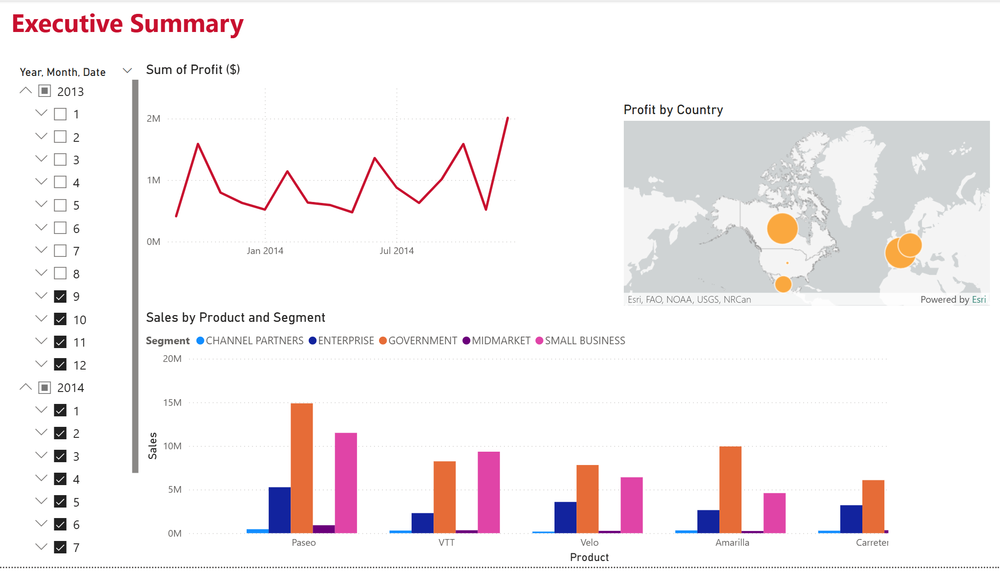

# Executive-Summary-PowerBI-Dashboard

## Dashboard Preview

---

## Overview

Developed an interactive Power BI dashboard to analyze sales performance across time, products, customer segments, and geographic regions. The project demonstrates the use of Power Query for data transformation, data modeling, and interactive data visualization to support business reporting and decision-making.

---

## Features

- Interactive line chart displaying profit trends over time
- Geographic map visualizing profit by country
- Clustered column chart comparing sales by product and customer segment
- Dynamic date slicers for filtering report results
- Clean, user-friendly dashboard designed for executive reporting

---

## Tools & Technologies

- Microsoft Power BI
- Power Query
- DAX
- Data Modeling
- Data Visualization
- Microsoft Excel

---

## Skills Demonstrated

- Data Transformation (ETL)
- Dashboard Development
- Interactive Reporting
- Business Intelligence
- Data Analysis
- Data Visualization

---

## Files

- `Executive Summary.pbix` – Power BI report file
- `powerbi1.png` – Dashboard preview

---

## Project Context

This project demonstrates the application of Power BI for data transformation, modeling, and interactive dashboard development using a business sales dataset.
